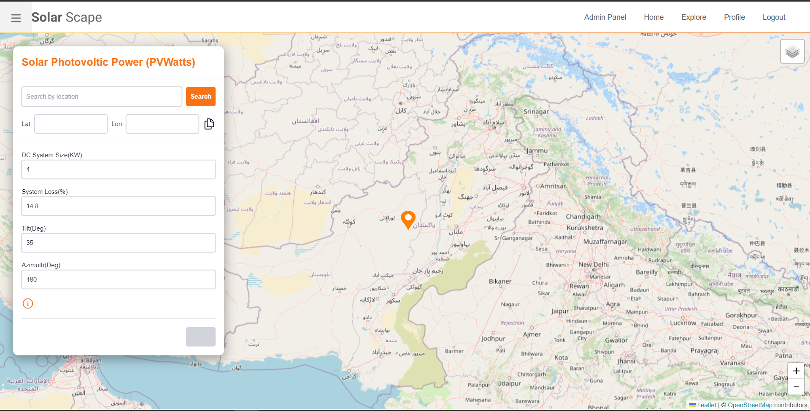

# Solar Scape

## Description

Solar Scape is a MERN Stack application for solar potential analysis, by utilizing solar data from [NREL PVWatts V8 API]("https://developer.nrel.gov/docs/solar/pvwatts/v8/"). And an embedded [Earth Engine APP]("https://ee-solarscape.projects.earthengine.app/view/solarscapeinsight") for advance solar potential assessment by utilizing google solar radiation [MERRA-2 M2T1NXRAD: Radiation Diagnostics V5.12.4]("https://developers.google.com/earth-engine/datasets/catalog/NASA_GSFC_MERRA_rad_2#bands").
The Application is built with `microservice architecture` by designing 2 services, one for user management and other for solar data management. The frontend is built with `react.js` combined with `tailwind CSS`, it also utilizes `styled components`. For database, `mongoDB` is used as central to both the services.

`Note: The app requires and NREL API key which can be created` [here]("https://developer.nrel.gov/").

## Features

- Solar Potential Assessment
- [Earth Engine App]("https://ee-solarscape.projects.earthengine.app/view/solarscapeinsight") for advance analysis
- User Management
- Interactive Dashboard
- Recent Activities
- Download Solar Assessment Data
- Password Reset

## Screenshots




These are some of the application interfaces, in order to expolre the further run the application via instruction given below.

## Prerequisites

Before you begin, ensure you have met the following requirements:

- Node.js (v20.1.1 or higher)
- MongoDB (installed locally or use MongoDB Atlas)
- Git (optional)

## Installation

### Backend Setup

1. Clone the repository:

   ```bash
   git clone https://github.com/ShahandFahad/solarscape.git
   ```

2. Navigate to the `services/usermanagement` directory:
   ```bash
   cd services/usermanagement
   ```
3. Install the required dependencies:
   ```bash
   npm install
   ```
4. Create a `.env` file in the `services/usermanagement/config/env/` directory with the following content:

   ```plaintext
   NODE_ENV=development or production
   PORT=specify_your_port or 8001
   DATABASE_URL=mongodb://localhost:27017/mydatabase or user_mongo_atlas_db_connection_string
   DATABASE_PASSWORD=your_db_password_if_there_is_one
   DB_USER=your_db_user_name_if_there_is


   # JWT Token
   # 90d for 90 days
   # 10m for 10 min
   # 3s for 3 seconds
   # JWT Algorithm will automatically figure it out

   JWT_SECRET=jwt-secret
   JWT_EXPIRES_IN=jwt-expiry-time
   JWT_COOKIE_EXPIRES_IN=jwt-cookie-expiry-time

   # Node mailer cred
   # email_host_is_gmail_or_use_according_to_your_choice
   EMAIL_HOST=smtp.gmail.com
   EMAIL_PORT=587
   EMAIL_SENDER=Solar Scape Fogert Password OTP
   ADMIN_EMAIL=put_your_email_which_will_be_used_for_sending_emails_to_users
   ADMIN_APP_PASS=put_your_app_pass_which_is_auto_generated_via_google_2_step_authentication_and_then_creating_your_app_pass_there

   # Feedback
   FEEDBACK_NAME=Solar Scape User Feedback
   FEEDBACK_EMAIL=put_your_email_which_will_recieve_feedbacks
   ```

5. Start the `usermangement service`:

   ```bash
   npm start
   ```

6. Navigate to the `services/dataretrieval` directory:
   ```bash
   cd services/dataretrieval/
   ```
7. Install the required dependencies:
   ```bash
   npm install
   ```
8. Create a `.env` file in the `services/dataretrieval/config/env/` directory with the following content:

   ```plaintext
   NODE_ENV=development or production
   PORT=specify_your_port or 8003
   DATABASE_URL=mongodb://localhost:27017/mydatabase or user_mongo_atlas_db_connection_string

   # create your API KEY HERE https://developer.nrel.gov/
   DEV_NREL_API_KEY=create_your_api_key_on_NREL_website_and_put_the_key_here_other_wise_the_application_will_not_show_results
   ```

### Frontend Setup

1. Navigate to the frontend directory:

```bash
cd ./frontend
```

2. Install the required dependencies:
   ```bash
   npm install
   ```
3. Incase if you have **started the servers on other ports**, then change the base url in:
   ```plaintext
   src/service/api.js
   src/service/interceptor.js
   ```
4. Start the frontend server:
   ```bash
   npm start
   ```

## Usage

- Open your browser and go to `http://localhost:3000` to access the application.
- Use the application features as intended.

## Known Bugs

Here are some known bugs in the current version of the application:

- [ ] **Issue 1:** The home page responsiveness breaks.

There are some others issues. So, If you encounter any other bugs, please open an issue or submit a pull request.

## TODOs

The following tasks are planned for future releases:

- [ ] **Add unit tests** for both frontend and backend.
- [ ] **Enhance user dashboard** with additional statistics.
- [ ] **Improve error handling** and display meaningful error messages to users.
- [ ] **Enable auto refresh token** to automatically refresh auth token for persistance.
- [ ] **Add security features** to data services as well.
- [ ] **Add state management** libraries to eliminate prop drilling. Or use context API

Feel free to suggest new features or improvements by opening an issue.

## Contributing

If you want to contribute to this project, follow these steps:

1. Fork the project.
2. Create your feature branch:
   ```bash
   git checkout -b feature/YourFeature
   ```
3. Commit your changes:
   ```bash
   git commit -m 'Add some feature'
   ```
4. Push to the branch:
   ```bash
   git push origin feature/YourFeature
   ```
5. Create a new Pull Request.

## License

This is an open source project. Feel free to utilize it for yourself.
